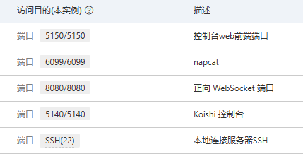
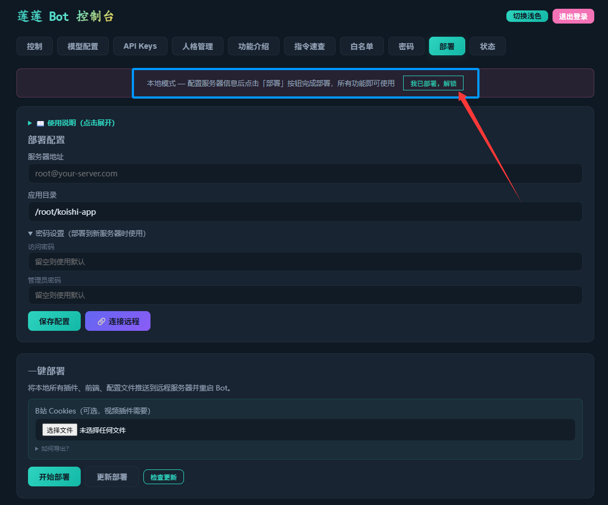
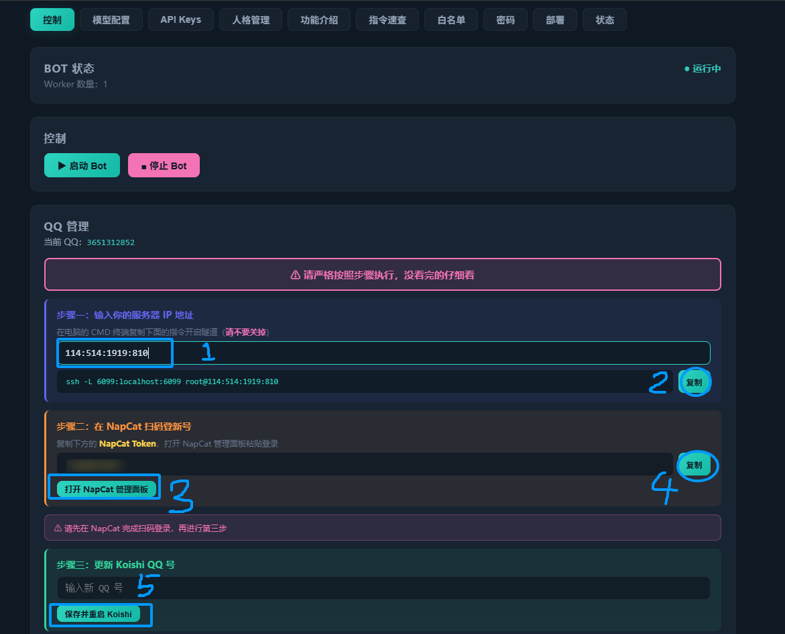
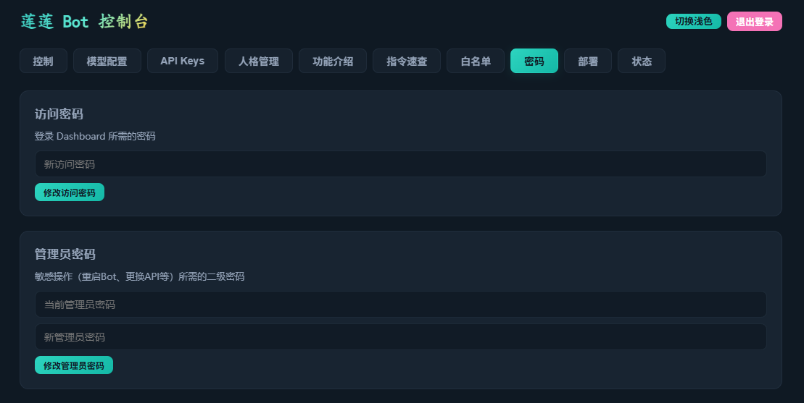
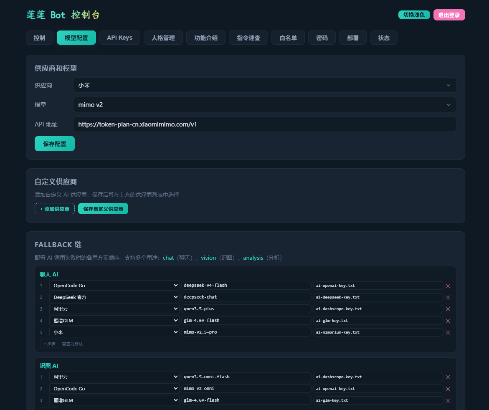
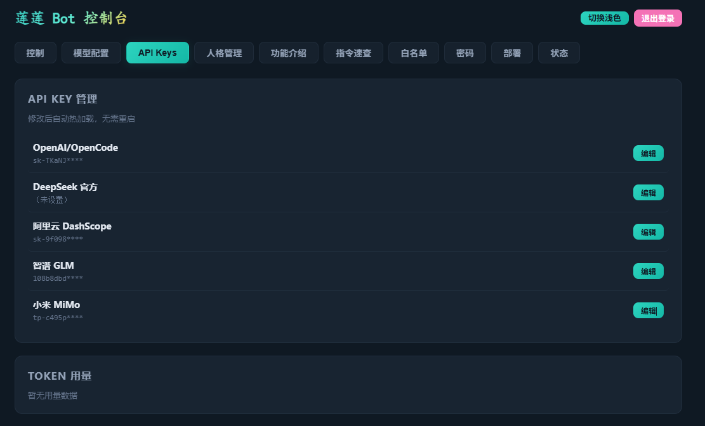

# LianLianBot README2

LianLianBot 是一套基于 `Koishi + NapCat + OneBot` 的 QQ Bot 工作区。它把 QQ 连接、AI 对话、Agent 工具、Dashboard 运维、Windows 本地部署器、Linux 服务器部署、群聊工具和插件化维护放在同一个仓库里。

这份 `readme2.md` 是按当前仓库状态重新整理的总览文档。它不替代 `README.md`，而是把所有模块、功能边界和部署方式重新按使用路径归类，方便你快速判断“我要装在哪里、要开什么、出了问题看哪里”。

---

## 目录

- [项目定位](#项目定位)
- [最快选择路线](#最快选择路线)
- [界面截图](#界面截图)
- [整体架构](#整体架构)
- [模块与功能总表](#模块与功能总表)
- [核心功能详情](#核心功能详情)
- [部署前准备](#部署前准备)
- [部署方式一：Windows EXE 部署器](#部署方式一windows-exe-部署器)
- [部署方式二：本地 Dashboard 部署工具](#部署方式二本地-dashboard-部署工具)
- [部署方式三：Dashboard 远程 Linux 更新部署](#部署方式三dashboard-远程-linux-更新部署)
- [部署方式四：Linux setup.sh 一键部署](#部署方式四linux-setupsh-一键部署)
- [部署方式五：传统 Linux 手动部署](#部署方式五传统-linux-手动部署)
- [部署方式六：单插件脚本部署](#部署方式六单插件脚本部署)
- [部署方式七：开发者辅助脚本](#部署方式七开发者辅助脚本)
- [启动、重启与守护](#启动重启与守护)
- [配置文件与运行数据](#配置文件与运行数据)
- [常用指令速查](#常用指令速查)
- [本地开发与测试](#本地开发与测试)
- [常见问题](#常见问题)
- [维护约定](#维护约定)

---

## 项目定位

LianLianBot 当前主要服务三类场景：

| 场景 | 推荐入口 | 说明 |
|---|---|---|
| Windows 新用户本机跑 Bot | `local-deployer/` 打包出来的部署器，或根目录 `启动本地部署器.bat` | 图形化完成 Node/npm、NapCat、Koishi 配置、扫码登录、健康检查 |
| 已有 Linux 服务器，想更新或维护 | Dashboard 的“部署”页 | 唯一远程生产更新入口；发布必须经过清单、预览、发布锁、基线复核和自动回滚 |
| 维护者/开发者本地准备与排错 | `setup.sh`、`scripts/*.sh`、`deploy.bat` | 只用于本地目录、初次准备或开发排错，不得用于绕过 Dashboard 更新远程生产环境 |

项目名对外统一称为 LianLianBot。历史包名里仍保留 `dongxuelian-*`，这是为了兼容 Koishi 插件名、数据文件和已有部署。

---

## 最快选择路线

如果你是普通 Windows 用户：

1. 解压 `LianLianBOT-Deployer-Portable-v版本号.zip`。
2. 运行 `莲莲Bot部署器.exe`。
3. 在部署页填机器人 QQ，点击一键部署。
4. 到等待扫码阶段，用机器人 QQ 扫 NapCat 登录码。
5. 在 Dashboard 的 API Keys / 模型配置页补 API Key。

如果你在源码目录里调试 Windows 本地部署器：

```powershell
启动本地部署器.bat
```

或：

```powershell
cd local-deployer
npm install
npm run start
```

如果你已有一台 Linux 服务器，并且 Dashboard 已经能打开：

1. 打开 `http://服务器IP:5150/dashboard/`。
2. 进入“部署”页。
3. 填 `root@服务器IP` 和目标目录，默认 `<YOUR_APP_DIR>`。
4. 点击远程操作，等待 Dashboard 自动构建前端、同步插件、重启 Bot。
5. 如果需要视频功能，在目标机 Dashboard 上传 B 站 `cookies.txt`，或由已授权运维人员将文件迁移到目标机标准路径并设置权限 `0600`。远程代码发布不会携带 Cookie。

如果你要从零部署 Linux：

```bash
QQ_NUMBER=机器人QQ ADMIN_QQ=管理员QQ bash setup.sh
```

如果你只更新一个插件：

```bash
KOISHI_APP_DIR=<YOUR_APP_DIR> sh scripts/ai.sh
KOISHI_APP_DIR=<YOUR_APP_DIR> sh scripts/name.sh
KOISHI_APP_DIR=<YOUR_APP_DIR> sh scripts/vedio.sh
```

---

## 界面截图

安全组端口配置：



Dashboard 首页：



QQ 管理与 NapCat 操作：



密码设置：



模型配置：



API Key 配置：



---

## 整体架构

```text
LianLianBot
├─ Koishi                         # Bot 运行框架
├─ NapCat + OneBot WS             # QQ 登录与消息连接
├─ packages/
│  ├─ koishi-plugin-dongxuelian-ai     # AI 主插件
│  ├─ koishi-plugin-dashboard          # Dashboard 后端与 Web 控制台
│  ├─ agent-console                    # React Agent Console
│  ├─ koishi-plugin-daily-report       # 群聊日报
│  ├─ koishi-plugin-group-name-at      # 昵称、集合、批量 at
│  ├─ koishi-plugin-local-video-sender # B 站视频解析发送
│  ├─ koishi-plugin-dongxuelian-help   # 帮助菜单
│  ├─ koishi-plugin-dongxuelian-poke   # 戳一戳响应
│  ├─ koishi-plugin-group-leave-notice # 退群提醒
│  ├─ koishi-plugin-defense            # 输入防护
│  └─ koishi-plugin-pet-bridge         # 桌宠 WebSocket 桥
├─ local-deployer/                # Electron Windows 部署器
├─ scripts/                       # Linux/远程/单插件部署脚本
├─ setup.sh                       # Linux 一键部署脚本
├─ data/                          # 本地运行数据
└─ runtime/                       # Windows 本地运行环境、日志、下载缓存
```

运行链路：

```text
QQ 消息
  ↓
NapCat
  ↓ OneBot WebSocket ws://127.0.0.1:8080/onebot/v11/ws
Koishi
  ↓
本仓库 Koishi 插件
  ↓
AI API / Agent 工具 / 群工具 / Dashboard / 日报 / 视频 / 图集
```

核心端口：

| 端口 | 默认用途 | 说明 |
|---|---|---|
| `5150` | Dashboard 独立控制台 | 浏览器访问 `/dashboard/`，也是部署面板入口 |
| `5140` | Koishi server | Koishi 自身服务端口 |
| `8080` | NapCat OneBot WebSocket | Koishi 连接 NapCat 的核心通道 |
| `6099` | NapCat WebUI | QQ 登录、Token、NapCat 管理 |
| `9600` | pet-bridge WebSocket | 仅监听 `127.0.0.1`，给桌宠或本机客户端使用 |
| `22` | SSH | Dashboard 远程部署 Linux 时使用 |

---

## 模块与功能总表

| 模块 | 路径 | 当前作用 |
|---|---|---|
| Windows 部署器 | `local-deployer/` | Electron 外壳，启动 Dashboard 后端和 Web 前端，支持本机一键部署、便携 Node/npm、NapCat 安装、打包 release |
| Dashboard 后端 | `packages/koishi-plugin-dashboard/` | 独立 HTTP 服务，提供鉴权、配置、部署、Bot 控制、NapCat 代理、图集、Agent、日志和环境检查 API |
| Dashboard 前端 | `packages/koishi-plugin-dashboard/frontend/` | Vue 控制台，包含状态、控制、配置、部署、QQ 管理、图集、Agent 等面板 |
| Agent Console | `packages/agent-console/` | React/Vite Agent 控制台，构建后通过 `/agent/` 访问 |
| AI 主插件 | `packages/koishi-plugin-dongxuelian-ai/` | AI 对话、模型供应商、人格、记忆、视觉、语音、搜索、Agent、敏感检测、白名单、黑名单、复读、反击等核心能力 |
| Agent 能力层 | `packages/koishi-plugin-dongxuelian-ai/lib/agent/` | 多轮工具调用、会话、队列、统计、计划、定时任务、Skill 市场、工作区技能、记忆整理 |
| Agent 工具 | `packages/koishi-plugin-dongxuelian-ai/lib/agent/tools/` | 时间、计算器、网页搜索、浏览器动作、读写文件、查找文件、grep、执行 JS、Shell、日志查询、图片分析、计划和记忆工具 |
| 帮助菜单 | `packages/koishi-plugin-dongxuelian-help/` | `help东雪莲`、`helpAI`、`help集合`、`指令速查` 等帮助入口 |
| 昵称与集合 | `packages/koishi-plugin-group-name-at/` | 昵称绑定、集合管理、集合运算、批量 at |
| B 站视频发送 | `packages/koishi-plugin-local-video-sender/` | 自动识别 B 站链接，或用 `bvidl` 下载并发送视频 |
| 群聊日报 | `packages/koishi-plugin-daily-report/` | 基础日报、详细日报、HTML 模板渲染、AI 分析 |
| 退群提醒 | `packages/koishi-plugin-group-leave-notice/` | 监听成员退群事件并在群里提示 |
| 戳一戳响应 | `packages/koishi-plugin-dongxuelian-poke/` | 调用 NapCat OneBot 扩展接口回戳 |
| 对话防护 | `packages/koishi-plugin-defense/` | 拦截常见提示词套话、角色覆盖、格式控制类输入 |
| 桌宠桥接 | `packages/koishi-plugin-pet-bridge/` | 在本机 `127.0.0.1:9600` 开 WebSocket，给桌宠查询状态、切模型、切人格、聊天、发群消息 |
| 部署脚本 | `scripts/` | 单插件复制、语法检查、注册 `koishi.yml`、重启、守护、数据目录封口 |
| Linux 一键部署 | `setup.sh` | 安装系统依赖、Node.js、NapCat、Koishi、配置文件、数据目录并启动 |
| Windows 批处理 | `启动本地部署器.bat` 等 | 启动、构建、卸载本地部署器；保留传统本地部署入口 |

---

## 核心功能详情

### Dashboard 控制台

Dashboard 是当前项目的运维核心，默认地址：

```text
http://服务器IP:5150/dashboard/
```

主要能力：

- 登录鉴权：访问密码无固定默认值；管理员密码默认 `123`，敏感操作会二次验证。
- 本地 Electron 模式：由 Windows 部署器打开时自动绕过 Web 密码页，适合普通用户本地部署。
- Bot 控制：查看状态、启动/停止 Koishi、本地停止、维护模式、节流配置、日志配置。
- QQ 管理：展示 NapCat Token、代理 NapCat WebUI、查看或修改机器人 QQ 号、重启 NapCat。
- 模型配置：切换 provider、model、base URL，支持内置和自定义供应商。
- API Keys：管理 OpenAI/OpenCode、DeepSeek、DashScope、GLM、小米 MiMo 等 Key。
- 人格和世界观：新增、编辑、删除 persona；管理 lore；查看 modes。
- 白名单和黑名单：群聊主动回复、静默白名单、高级功能白名单、用户黑名单、视频黑名单。
- 图集：上传图片，按 16:9 / 4:3 / 9:16 展示，支持 A-G 闪卡样式并按图片持久化。
- Agent 面板：会话、队列、统计、工具开关、文件浏览/上传、计划、定时任务、TTS 声音。
- 部署面板：环境检测、Windows 本地部署、NapCat 下载、便携 Node/npm、npm install、远程 Linux 更新部署、前端重建、卸载预览。

### AI 主插件

AI 主插件负责 QQ 群聊和私聊里的智能行为：

- @ 机器人触发对话。
- 私聊触发对话。
- 群聊白名单内按概率主动插话。
- 上下文记忆、会话摘要、用户画像。
- 用户级人格、群级人格、世界观 lore、系统模式 modes。
- 支持联网搜索和思考模式开关。
- 支持 fallback 模型链和自定义 provider。
- 支持视觉模型、图片分析、贴纸素材、表情渲染。
- 支持 ASR/TTS、声音配置、TTS 预览和克隆管理入口。
- 支持敏感话题检测、处理者通知、事件抓取、消息定位。
- 支持复读、反击、输出泄漏防护、越狱输入/输出防护。
- 支持 AI 工具模式，让 Agent 在可控范围内调用工具。

内置供应商来自 `lib/constants.js`：

| Provider | 默认 Base URL | 说明 |
|---|---|---|
| `opencode` | `https://opencode.ai/zen/go/v1` | OpenCode Go，内置多模型列表 |
| `dashscope` | `https://dashscope.aliyuncs.com/compatible-mode/v1` | 阿里云 DashScope 兼容模式 |
| `deepseek` | `https://api.deepseek.com` | DeepSeek 官方 |
| `glm` | `https://open.bigmodel.cn/api/paas/v4` | 智谱 GLM |
| `mimorium` | `https://token-plan-cn.xiaomimimo.com/v1` | 小米 MiMo |
| 自定义 | 写入 `ai-providers-custom.json` | 由 Dashboard 自定义供应商页管理 |

### Agent 能力

Agent 能力在 QQ 和 Dashboard 两个渠道中可独立配置工具开关。工具注册器会按渠道过滤工具，危险工具默认需要谨慎开启。

工具大类：

- 信息工具：`get_time`、`calculator`、`web_search`、`query_logs`、`get_token_usage`。
- 文件工具：读文件、列文件、找文件、grep、写文件、追加文件、编辑文件、发送文件给用户。
- 执行工具：Shell、执行 JavaScript、浏览器动作。
- 图片工具：读取图片 URL、分析图片。
- Skill 工具：读取 Agent Skill、扫描工作区技能、Skill 市场和 GitHub Hub。
- 计划工具：创建计划、更新任务状态、完成/放弃计划。
- 记忆工具：记住、遗忘、读取记忆等。

Agent 面板还提供：

- 会话列表和队列状态。
- 工具总览和渠道开关。
- 工作区文件浏览、预览、下载和上传。
- 计划管理与定时任务。
- 推送日志、运行统计和 Shell guard 状态。

### 群工具

| 功能 | 说明 |
|---|---|
| 帮助菜单 | 帮助用户查看 AI、集合、速查等指令 |
| 昵称绑定 | 给群成员绑定昵称，用昵称查人或 at |
| 集合管理 | 创建集合、增删成员、清空/删除二次确认、重命名、复制、合并 |
| 集合运算 | 交集、并集、差集 |
| 批量 at | `at昵称`、`at集合名` |
| 日报 | 基础群聊日报和 AI 详细日报 |
| 谁艾特我 | 查询当天谁在群里 @ 过自己，并可引用定位跳转 |
| B 站视频 | 自动解析 B 站链接或手动 `bvidl` 下载发送 |
| 戳一戳 | 收到戳一戳后通过 NapCat 回戳 |
| 退群提醒 | 成员退群后群内提醒 |
| 对话防护 | 拦截提示词注入、角色覆盖和格式操控 |

### pet-bridge 桌宠桥

`koishi-plugin-pet-bridge` 默认监听：

```text
ws://127.0.0.1:9600
```

它是可选模块。当前 `koishi.example.yml` 和 Dashboard 本地生成配置默认不会启用 `pet-bridge`；需要桌宠桥接时，在 `koishi.yml` 里手动增加：

```yaml
pet-bridge: {}
```

如果要改端口，可按 Koishi 插件配置传入 `port`。

它不改 Koishi 消息中间件，只提供本机 WebSocket 协议给桌宠或桌面客户端：

- 查询 AI provider、model、base URL、联网、思考状态。
- 查询人格列表、当前人格、用户记忆摘要。
- 切换模型、联网、思考、维护模式。
- 管理主动回复白名单。
- 切换桌面用户人格。
- 向群发送文本消息。
- 直接发起桌宠聊天请求。

---

## 部署前准备

### 通用材料

- 一个机器人 QQ 号，建议不要使用主号。
- 可选：Linux 服务器，推荐 Ubuntu 22.04，2 核 2G 起步。
- 可选：AI 供应商 API Key。
- 可选：B 站 `cookies.txt`，用于更稳定的视频下载。

### Windows 本地要求

- 推荐 Windows 10/11。
- Node.js 18+ 或由部署器安装便携 Node/npm。
- 端口 `5140`、`5150`、`8080`、`6099` 未被占用。
- NapCat 首次启动需要扫码登录。

### Linux 服务器要求

- 能通过 SSH 登录，例如 `ssh root@服务器IP`。
- Node.js 18+。
- `git`、`curl`、`wget`、`unzip`、`screen`、`xvfb`、`ffmpeg` 等基础工具。
- NapCat / LinuxQQ 可运行。
- 云安全组至少放行 `22` 和 `5150`。排错阶段可临时放行 `6099`、`8080`、`5140`，稳定后按实际需要收紧。

### 安全组建议

| 端口 | 是否建议公网开放 | 原因 |
|---|---|---|
| `22` | 必须能从你的电脑访问 | SSH 部署和维护 |
| `5150` | 需要浏览器访问时开放 | Dashboard |
| `6099` | 可选 | NapCat WebUI，可用 SSH 隧道替代 |
| `8080` | 一般不建议公网开放 | OneBot WS 通常只需本机访问 |
| `5140` | 一般不建议公网开放 | Koishi 自身服务 |

---

## 部署方式一：Windows EXE 部署器

适合普通 Windows 用户，也是项目当前最友好的安装路线。

### 发行包使用

1. 下载 release 里的便携版 `LianLianBOT-Deployer-Portable-v版本号.zip`。
2. 完整解压，不要在压缩包预览窗口里直接双击。
3. 运行 `莲莲Bot部署器.exe`。
4. 在部署页填机器人 QQ。
5. 点击一键部署，部署器会按流程完成：

```text
环境检测
→ 安装便携 Node/npm
→ 安装 NapCat
→ 生成 Koishi 配置
→ npm install
→ 启动 NapCat
→ 等待扫码
→ 启动 Koishi
→ 健康检查
```

便携版首次发生写入动作时，会在 EXE 同级创建：

```text
LianLianBOT/
├─ data/
├─ runtime/
│  ├─ node/
│  ├─ napcat/
│  ├─ downloads/
│  └─ logs/
├─ packages/
├─ scripts/
├─ koishi.yml
└─ start-local.bat
```

如果你需要开始菜单或桌面快捷方式，下载并运行安装版 `LianLianBOT-Deployer-Setup-v版本号.exe`。安装版只把应用本体放在安装目录，运行数据默认写入：

```text
%USERPROFILE%\Documents\LianLianBOT\
```

如果文档目录不可写，会回退到 Electron 用户数据目录。

### 源码运行部署器

```powershell
cd local-deployer
npm install
npm run start
```

也可以在仓库根目录双击：

```text
启动本地部署器.bat
```

源码模式会打开 Dashboard，本地地址通常是：

```text
http://127.0.0.1:5150/dashboard/
```

### 构建 Windows 部署器

```powershell
cd local-deployer
npm install
npm run build:win
```

或在根目录双击：

```text
构建Windows部署器.bat
```

根目录构建脚本会先构建 Dashboard 前端，再执行部署器 release 打包。发布产物统一整理到：

```text
local-deployer/release/
├─ LianLianBOT-Deployer-Portable-v版本号.zip
├─ LianLianBOT-Deployer-Setup-v版本号.exe
├─ README.txt
└─ README-安装版.txt
```

Release 建议同时上传便携版 zip 和安装版 setup exe。普通用户优先下载便携版 zip；需要系统安装和快捷方式时再下载安装版 setup exe。不要把 setup exe 重命名成普通运行 exe，也不要在压缩包预览窗口里直接运行便携版。

### 卸载与清理

根目录：

```text
卸载本地部署器.bat
```

默认保留 `data/` 和 `runtime/`，避免误删 API Key、记忆、日志、NapCat 和 cookies。用户明确确认后才会彻底清理。

---

## 部署方式二：本地 Dashboard 部署工具

适合你在源码目录里打开 Dashboard，再用 Web 页面完成 Windows 本地部署或远程 Linux 更新。

安装依赖：

```bash
npm install
```

启动 Dashboard：

```bash
cd packages/koishi-plugin-dashboard
node standalone.js
```

访问：

```text
http://localhost:5150/dashboard/
```

如果修改过 Dashboard 前端：

```bash
cd packages/koishi-plugin-dashboard/frontend
npm install
npm run build
```

本地部署页可以做：

- 检测 Node.js、npm、项目依赖、中文路径写入和端口占用。
- 安装便携 Node/npm 到 `runtime/node/`。
- 下载并安装 NapCat Windows 包到 `runtime/napcat/`。
- 生成 `koishi.yml`、`start-local.bat` 和本地部署清单。
- 写入 provider、model、base URL、API Key、管理员 QQ。
- 执行或引导执行 `npm install`。
- 启动 NapCat、启动 Koishi、停止本地 Bot。
- 预览和删除部署器生成的 Koishi 配置。
- 预览和执行本地卸载。

---

## 部署方式三：Dashboard 远程 Linux 更新部署

这个方式适合已有服务器。它不是从 GitHub 拉代码，而是把“当前 Dashboard 后端所在机器”的代码推送到远程服务器。

入口：

```text
Dashboard → 部署 → 远程 Linux 部署
```

默认目标目录：

```text
<YOUR_APP_DIR>
```

部署前确认：

- 本机能直接 SSH 到服务器。
- 远端已有基本 Koishi/NapCat 环境，或至少已有可识别的 Koishi 安装。
- 远端安全组放行 `5150`。
- 机器人 QQ 已能在 NapCat 登录。
- 如果要用 B 站视频，请在目标机 Dashboard 上传 `bilibili-cookies.txt`，或由已授权运维人员迁移到目标机标准路径并设置权限 `0600`。

远程更新会同步：

- AI、帮助、昵称集合、防护、视频、退群、戳一戳、日报等插件的 `lib/` 和 `package.json`。
- Dashboard 后端 `standalone.js`。
- Dashboard 前端源码、public、构建后的 `dist/`。
- AI Skills 种子文件到远端 `data/ai-skills`，不会覆盖已存在文件。
- `restart.sh`、`watchdog.sh`、`seal-data-dir.sh`。
- 然后执行远程 `restart.sh` 并做端口/日志健康检查。

远程代码发布明确排除 B 站 Cookie、API Key、`deploy-config.json` 和其他运行数据。目标服务器的标准 Cookie 路径是 `/root/koishi-app/data/bilibili-cookies.txt`。

注意：

- `pet-bridge` 是可选桌宠桥接插件，当前 Dashboard 远程同步清单不默认包含它；需要时请手动同步并在 `koishi.yml` 注册。
- “重建前端”只在当前 Dashboard 后端所在机器构建本地 `dist/`。
- 要把新页面同步到服务器，需要构建成功后再执行远程部署。
- Dashboard 会记录部署指纹，用于判断当前代码是否已经同步。

---

## 部署方式四：Linux setup.sh 一键部署

适合从零部署 Linux 服务器，或重建一台干净服务器。

当前脚本读取环境变量：

```bash
QQ_NUMBER=机器人QQ ADMIN_QQ=管理员QQ bash setup.sh
```

可覆盖路径：

```bash
QQ_NUMBER=机器人QQ \
ADMIN_QQ=管理员QQ \
KOISHI_DIR=<YOUR_APP_DIR> \
DATA_DIR=<YOUR_DATA_DIR> \
NAPCAT_DIR=/root/Napcat \
bash setup.sh
```

脚本会做：

- 安装 Node.js 18。
- 安装系统依赖。
- 下载并运行 NapCat 官方安装器。
- 写入 NapCat WebUI 配置，默认端口 `6099`，默认 token `123`。
- 写入 OneBot WebSocket，默认 `127.0.0.1:8080`。
- 准备 `<YOUR_APP_DIR>`。
- 安装 npm 依赖。
- 创建 `data/`、`ai-skills/`、会话、用户画像等目录。
- 复制随包 AI Skills 种子。
- 写入 `koishi.yml`。
- 启动 NapCat，等待扫码。
- 启动 Koishi。

成功后看日志：

```bash
tail -f <YOUR_APP_DIR>/koishi.log
```

---

## 部署方式五：传统 Linux 手动部署

适合需要一步步排错的服务器。

### 1. 安装基础依赖

```bash
curl -fsSL https://deb.nodesource.com/setup_18.x | bash -
apt-get install -y nodejs
apt-get update
apt-get install -y curl wget git unzip jq xvfb screen procps \
  tesseract-ocr tesseract-ocr-chi-sim ffmpeg python3 python3-pip
pip3 install yt-dlp
```

### 2. 克隆仓库并安装 npm 依赖

```bash
git clone https://github.com/qiongtu2077/dongxuelian-qqbot.git <YOUR_APP_DIR>
cd <YOUR_APP_DIR>
npm install
```

### 3. 安装 NapCat

```bash
curl -k -L -# -o napcat.sh "https://nclatest.znin.net/NapNeko/NapCat-Installer/raw/main/install.sh"
bash napcat.sh --docker n --cli y --proxy 0 --force
```

### 4. 写入 Koishi 配置

示例：

```yaml
plugins:
  server:emicam:
    port: 5140
    selfUrl: http://localhost:5140
  adapter-onebot:xtqqgv:
    protocol: ws
    selfId: '机器人QQ'
    endpoint: ws://127.0.0.1:8080/onebot/v11/ws
  group-name-at:nyxxfd: {}
  dongxuelian-help:rlmpxx: {}
  dongxuelian-ai:hdi04m: {}
  dongxuelian-poke:nxf8l0: {}
  koishi-plugin-defense:xlyp9f: {}
  local-video-sender:k2w0u7: {}
  group-leave-notice:h6lfrz: {}
  daily-report: {}
```

项目根目录里也有 `koishi.example.yml` 可参考。

### 5. 准备数据目录

```bash
cd <YOUR_APP_DIR>
mkdir -p data/ai-skills/core data/ai-skills/personas data/ai-skills/modes data/ai-skills/lore
mkdir -p data/user-profiles data/conversations data/ai-event-dumps data/political-handlers
cp -rn packages/koishi-plugin-dongxuelian-ai/data/ai-skills/. data/ai-skills/
```

写入基础 AI 配置：

```bash
echo "opencode" > data/ai-provider.txt
echo "deepseek-v4-flash" > data/ai-model.txt
echo "https://opencode.ai/zen/go/v1" > data/ai-base-url.txt
echo "[]" > data/ai-random-whitelist.json
echo "[]" > data/ai-user-blacklist.json
echo "{}" > data/ai-repeat-enabled.json
echo "off" > data/ai-enable-search.txt
echo "off" > data/ai-enable-thinking.txt
```

### 6. 启动 NapCat 并扫码

```bash
screen -dmS napcat bash -c \
  "xvfb-run -a /root/Napcat/opt/QQ/qq --no-sandbox -q 机器人QQ"
screen -r napcat
```

看到二维码后扫码，按 `Ctrl+A` 再按 `D` 退出 screen 附着。

### 7. 启动 Koishi

```bash
cd <YOUR_APP_DIR>
KOISHI_DIR=<YOUR_APP_DIR> DONGXUELIAN_AI_DATA_DIR=<YOUR_DATA_DIR> \
nohup node node_modules/koishi/bin.js start >> koishi.log 2>&1 &
```

---

## 部署方式六：单插件脚本部署

`scripts/deploy-package.sh` 是共享部署工具。各插件脚本会调用它，把源码复制到目标 Koishi 的 `node_modules`，执行 `node -c` 语法检查，并在 `koishi.yml` 中注册插件。

默认目标目录：

```text
<YOUR_APP_DIR>
```

可覆盖：

```bash
KOISHI_APP_DIR=/你的/koishi目录 sh scripts/ai.sh
```

脚本表：

| 脚本 | 部署内容 | Koishi key |
|---|---|---|
| `scripts/ai.sh` | AI 主插件和 AI Skills | `dongxuelian-ai` |
| `scripts/help.sh` | 帮助菜单 | `dongxuelian-help` |
| `scripts/name.sh` | 昵称和集合 | `group-name-at` |
| `scripts/vedio.sh` | B 站视频发送 | `local-video-sender` |
| `scripts/defense.sh` | 对话防护 | `koishi-plugin-defense` |
| `scripts/poke.sh` | 戳一戳 | `dongxuelian-poke` |
| `scripts/leave.sh` | 退群提醒 | `group-leave-notice` |
| `scripts/message-reader.sh` | AI 插件内消息读取能力 | 实际转调 `ai.sh` |
| `scripts/restart-bot.sh` | 服务器重启脚本 | 通常部署为 `<YOUR_APP_DIR>/restart.sh` |
| `scripts/watchdog.sh` | Dashboard 守护 | 监听 `5150`，崩溃后拉起 |
| `scripts/seal-data-dir.sh` | 数据目录封口 | 合并包内 data 并软链到根 `data` |

示例：

```bash
cd <YOUR_APP_DIR>
KOISHI_APP_DIR=<YOUR_APP_DIR> sh scripts/ai.sh
bash <YOUR_APP_DIR>/restart.sh
```

---

## 部署方式七：开发者辅助脚本

### `deploy.bat`

传统 Windows 本地部署脚本，会把 `packages/koishi-plugin-*` 复制到目标目录的 `node_modules`，创建 `koishi.yml`、`data/` 和 `start-local.bat`。

```powershell
deploy.bat
deploy.bat D:\Some\KoishiApp
```

它是保留的 Windows 本地目录部署方案，不用于远程生产发布。远程生产更新只能使用 Dashboard 的“部署”页。

### `setup.bat`

准备 Windows 本地源码目录：

- 检查 Node.js/npm。
- 创建 `runtime/downloads`、`runtime/logs`、`runtime/napcat`、`data`。
- 提示使用 Dashboard 生成 `koishi.yml`。

### 已停用的旧远程直传脚本

`scripts/deploy-frontend.bat` 与 `scripts/deploy-and-restart.bat` 已停用并固定返回失败。它们曾经直接上传前端或日报文件后重启，会绕过发布清单、预览、发布锁、远端基线复核和自动回滚。

Dashboard 的“部署”页是唯一远程生产更新入口；完整不可变发布物已经同时包含 Dashboard 前端与日报插件，不再支持单文件直传更新。

---

## 启动、重启与守护

### 服务器重启 Bot

```bash
bash <YOUR_APP_DIR>/restart.sh
```

`restart.sh` / `scripts/restart-bot.sh` 会：

1. 执行 `seal-data-dir.sh`，确保运行数据统一在根 `data/`。
2. 杀掉旧 Koishi worker。
3. 检查 `5140` 是否释放。
4. 确保 Dashboard `5150` 正在运行。
5. 启动 Koishi。
6. 轮询日志，等待 `adapter connect to server`。

### Dashboard 守护

```bash
nohup bash <YOUR_APP_DIR>/scripts/watchdog.sh \
  > <YOUR_APP_DIR>/packages/koishi-plugin-dashboard/watchdog.log 2>&1 &
```

它每 10 秒检查 Dashboard 端口，发现 `5150` 没有监听时自动拉起 `standalone.js`。

### 查看日志

```bash
tail -f <YOUR_APP_DIR>/koishi.log
```

常见成功信号：

```text
LianBoard running on http://localhost:5150/dashboard/
adapter connect to server
dongxuelian-ai 1.1.6 loaded
```

---

## 配置文件与运行数据

运行数据由 `DONGXUELIAN_AI_DATA_DIR` 控制。默认规则：

| 环境 | 默认数据目录 |
|---|---|
| 服务器部署 | `<YOUR_DATA_DIR>` |
| 源码本地运行 | `<项目根目录>/data` |
| Windows 便携版部署器 | EXE 同级 `LianLianBOT/data` |
| Windows 安装版部署器 | `%USERPROFILE%\Documents\LianLianBOT\data`，不可写时回退到 Electron 用户数据目录 |

`scripts/seal-data-dir.sh` 会把以下包内 data 目录封成软链：

```text
packages/koishi-plugin-dongxuelian-ai/data
packages/koishi-plugin-group-name-at/data
packages/koishi-plugin-local-video-sender/data
```

这样 AI、Dashboard、昵称集合、视频插件都写同一个根 `data/`，避免数据分裂。

### 常用数据文件

| 文件或目录 | 作用 |
|---|---|
| `ai-provider.txt` | 当前 AI 供应商 |
| `ai-model.txt` | 当前模型 |
| `ai-base-url.txt` | OpenAI 兼容 API 地址 |
| `ai-openai-key.txt` | OpenAI/OpenCode 兼容 Key |
| `ai-deepseek-key.txt` | DeepSeek Key |
| `ai-dashscope-key.txt` | DashScope Key |
| `ai-glm-key.txt` | GLM Key |
| `ai-mimorium-key.txt` | 小米 MiMo Key |
| `ai-providers-custom.json` | 自定义供应商 |
| `ai-fallback-chains.json` | fallback 模型链 |
| `ai-skills/` | core、personas、modes、lore、docs 等 Skill |
| `ai-persona-users.json` | 用户级人格绑定 |
| `ai-persona-groups.json` | 群级人格绑定 |
| `ai-random-whitelist.json` | 群聊主动回复白名单 |
| `ai-random-rate.json` | 主动回复概率配置 |
| `ai-user-blacklist.json` | 用户黑名单 |
| `video-blacklist.json` | 视频解析黑名单 |
| `group-name-at-disabled-groups.json` | 群聊昵称黑名单 |
| `summary-whitelist.json` | 日报、谁艾特我、缓存等高级功能白名单 |
| `dashboard-access-pwd.txt` | Dashboard 访问密码 |
| `dashboard-admin-pwd.txt` | Dashboard 管理员密码 |
| `today-cache-*.json` | 当日群聊缓存 |
| `conversations/` | 对话上下文和摘要 |
| `user-profiles/` | 用户画像和长期记忆 |
| `ai-voices/` | TTS 声音资源 |
| `gallery/` 或图集相关目录 | Dashboard 图集图片与元数据 |

### 常用环境变量

| 变量 | 默认值 | 作用 |
|---|---|---|
| `KOISHI_DIR` | 当前目录或部署目录 | Koishi 工作目录 |
| `KOISHI_APP_DIR` | `<YOUR_APP_DIR>` | 部署脚本使用的 Koishi 目录 |
| `DONGXUELIAN_AI_DATA_DIR` | `KOISHI_DIR/data` | AI 与相关插件共享数据目录 |
| `DASHBOARD_HOST` | `0.0.0.0` 或代码默认 | Dashboard 监听地址 |
| `DASHBOARD_PORT` | `5150` | Dashboard 端口 |
| `DASHBOARD_PASSWORD` | 空 | 首次访问密码默认值 |
| `DASHBOARD_ADMIN_PASSWORD` | `123` | 管理员密码默认值 |
| `KOISHI_PORT` | `5140` | Koishi 服务端口 |
| `NAPCAT_HOST` | `127.0.0.1` | Dashboard 代理 NapCat 的地址 |
| `NAPCAT_PORT` | `6099` | NapCat WebUI 端口 |
| `NAPCAT_TOKEN` | 从数据或配置读取 | NapCat WebUI token |
| `BILI_YTDLP` | `/usr/local/bin/yt-dlp` | 视频下载工具路径 |
| `BILI_COOKIES_FILE` | `${DONGXUELIAN_AI_DATA_DIR}/bilibili-cookies.txt` | B 站 cookies；生产标准为 `/root/koishi-app/data/bilibili-cookies.txt` |
| `BILI_WORKDIR` | `/root/koishi-bili-downloads` | 视频临时下载目录 |
| `BILI_MAX_SIZE_BYTES` | `209715200` | 单视频大小限制，默认 200MB |
| `AI_RANDOM_TRIGGER_RATE` | `0.008` | 主动回复基础概率 |
| `AI_REQUEST_TIMEOUT_MS` | `40000` | AI 请求超时 |

---

## 常用指令速查

### 帮助

| 指令 | 作用 |
|---|---|
| `help东雪莲` | 主帮助 |
| `helpAI` | AI 功能帮助 |
| `help集合` | 昵称和集合帮助 |
| `指令速查` | 常用命令速查 |

### AI 与模型

| 指令 | 作用 |
|---|---|
| `AI状态` | 查看当前 AI 配置和状态 |
| `可用模型` | 查看可选模型 |
| `切换模型 <provider> <model>` | 切换供应商和模型 |
| `联网开` / `联网关` | 控制联网搜索 |
| `东雪莲思考开` / `东雪莲思考关` | 控制思考模式 |
| `群聊AI白名单添加 <群号>` | 开启群聊主动回复 |
| `群聊AI静默白名单添加 <群号>` | 群内保持静默 |
| `用户黑名单添加 <QQ号>` | 禁止指定用户触发 AI |

### 人格与记忆

| 指令 | 作用 |
|---|---|
| `人格列表` | 查看可用人格 |
| `切换人格 <名称>` | 切换当前人格 |
| `群人格 <名称>` | 给群绑定人格 |
| `我的记忆` | 查看个人记忆摘要 |
| `忘记我` | 清理个人记忆 |

### 昵称、集合和批量 at

| 指令 | 作用 |
|---|---|
| `@A 昵称 名称A` | 给成员绑定昵称 |
| `删除昵称 名称A` | 删除昵称 |
| `查看昵称 名称A` / `谁是 名称A` | 查询昵称对应成员 |
| `@A 查看昵称` / `查看昵称 @A` | 查看某人的昵称和集合 |
| `nicklist` | 查看本群昵称 |
| `创建集合 集合A @A @B` | 创建多人集合 |
| `集合添加 集合A @A` | 添加成员 |
| `集合删除 集合A @A` | 删除成员 |
| `集合交集 A B` | 集合运算 |
| `at名称A` / `at集合A` | 批量 at |
| `群聊昵称黑名单添加 <群号>` / `删除 <群号>` / `查看` | 管理禁用昵称、集合和批量 at 的群 |

### 日报、视频和事件

| 指令 | 作用 |
|---|---|
| `群聊日报` | 生成基础日报 |
| `群聊详细日报` | 生成 AI 详细日报 |
| `谁艾特我` / `谁@我` | 查看当天 @ 记录 |
| `定位消息 <编号>` | 回复引用 @ 记录中的目标消息，可点跳转；失败时回退上下文 |
| `bvidl <B站链接或BV号>` | 手动下载并发送视频 |
| 直接发送 B 站链接 | 自动解析视频 |
| `sendtestvideo` | 发送本地测试视频 |
| `AI抓事件` / `AI抓事件查看` / `AI抓事件取消` | 调试原始事件 |

### 调试和安全

| 指令 | 作用 |
|---|---|
| `敏感话题检测开` / `敏感话题检测关` | 管理敏感话题检测 |
| `敏感话题处理者添加 <QQ号>` | 添加通知处理者 |
| `东雪莲复读开` / `东雪莲复读关` | 控制复读 |
| `东雪莲测试开` / `东雪莲测试关` | 管理员测试模式 |
| `东雪莲嘴臭开` / `东雪莲嘴臭关` | 高强度反击模式 |

---

## 本地开发与测试

安装依赖：

```bash
npm install
```

语法检查：

```bash
npm run check
```

快速测试：

```bash
npm run test:quick
```

场景测试：

```bash
npm run test:scenario
```

插件测试：

```bash
npm run test:plugins
```

完整测试（提交、发布和 CI 的唯一信任入口，包含 Dashboard、Agent Console、类型检查、构建和同步验证）：

```bash
npm test
```

本机安装 Chrome 或 Edge 时，可额外运行 Dashboard 点击烟测：

```bash
npm run test:dashboard-click
```

当前发布继续提交各插件 `lib/` 及前端 `dist/`；完整测试会重建并校验这些生成物没有漂移。新临时文件放入 `tmp/workspace/`，临时发布包放入 `tmp/releases/`。

Dashboard 前端开发：

```bash
cd packages/koishi-plugin-dashboard/frontend
npm install
npm run dev
```

Dashboard 前端构建：

```bash
cd packages/koishi-plugin-dashboard/frontend
npm run build
```

Agent Console 构建：

```bash
npm run build:agent-console
```

更多测试规范见 `测试文件维护指南.md`。

---

## 常见问题

### Dashboard 打不开

检查：

```bash
ss -tlnp | grep 5150
tail -f <YOUR_APP_DIR>/koishi.log
```

常见原因：

- 安全组没有放行 `5150`。
- `DASHBOARD_PORT` 被改过。
- `packages/koishi-plugin-dashboard/frontend/dist/` 不存在。
- `watchdog.sh` 没有运行。
- 端口被旧进程占用。

### Koishi 连不上 NapCat

检查：

```bash
ss -ltnp | grep 8080
```

常见原因：

- NapCat 没有登录机器人 QQ。
- NapCat 没启用正向 WebSocket。
- `koishi.yml` 的 `endpoint` 和 NapCat 端口不一致。
- `selfId` 不是机器人 QQ。
- Access Token 两边不一致。

### AI 不回复

优先检查：

- `AI状态` 是否正常。
- provider、model、base URL 是否匹配。
- 对应 API Key 文件是否存在。
- 当前群是否在主动回复白名单。
- 当前群是否在静默白名单。
- 当前用户是否在黑名单。
- 是否开启维护模式。
- 供应商是否支持当前能力，例如视觉、联网或思考。

### 日报没有数据

检查：

- 群号是否在 `summary-whitelist.json`。
- 当天是否已有足够聊天记录。
- Chrome/Chromium 或图片渲染依赖是否可用。
- 详细日报需要 AI 配置可用。

### B 站视频发不出来

检查：

- `yt-dlp --version` 是否可用。
- `BILI_COOKIES_FILE` 是否存在。
- 视频是否超过 `BILI_MAX_SIZE_BYTES`。
- 当前群是否在视频黑名单。
- 服务器是否有 `ffmpeg`。

### Windows 本地部署页显示 Linux 路径

说明你访问的是远程 Linux 上的 Dashboard，不是 Windows 本机部署器。Windows 本地部署必须让 Dashboard 后端运行在 Windows 本机，推荐使用 `莲莲Bot部署器.exe` 或 `启动本地部署器.bat`。

### 5141 或 80 是本项目端口吗

当前主线没有使用 `5141` 或 `80` 作为业务端口。如果防火墙里有这两个端口，多半是旧规则、其他服务或反向代理。

---

## 维护约定

- 插件业务逻辑放在 `packages/*/lib/`。
- 部署脚本只做部署，不把大段业务 JS 内嵌进 Markdown。
- 修改 Dashboard 前端后，记得在 `packages/koishi-plugin-dashboard/frontend/` 里重新 `npm run build`。
- 修改 AI 主插件前，先看 `AI协作规则.md`、`教训总结.md`、`测试文件维护指南.md`。
- 修改端口、数据目录、部署路径时，同步检查 `README.md`、`readme2.md`、`setup.sh`、`scripts/restart-bot.sh`、`packages/koishi-plugin-dashboard/standalone.js`。
- 改插件后至少跑 `npm run check`；涉及 shared 行为、Agent、部署、日报、Dashboard 时继续跑相关测试。
- 服务器数据统一以根 `data/` 为准，包内 `data` 只作为随包种子或软链入口。
- Release 附件上传 `local-deployer/release/LianLianBOT-Deployer-Portable-v版本号.zip` 和 `local-deployer/release/LianLianBOT-Deployer-Setup-v版本号.exe`。

---

## 仓库入口索引

| 入口 | 用途 |
|---|---|
| `README.md` | 现有主 README |
| `readme2.md` | 当前重新整理版 |
| `local-deployer/README.md` | Windows 部署器专项说明 |
| `部署教程.txt` | 传统 Linux 部署备份教程 |
| `测试文件维护指南.md` | 测试说明 |
| `开发总结.md` | 维护记录 |
| `教训总结.md` | 排错经验 |
| `后续优化.md` | 后续优化方向 |
| `AI协作规则.md` | AI 主插件协作约束 |
